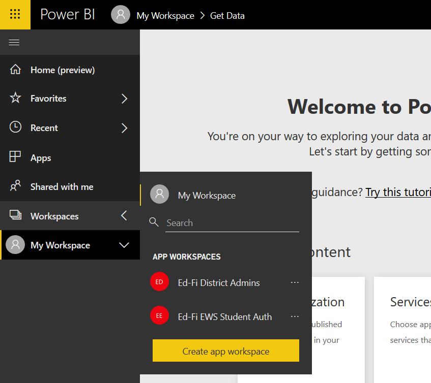
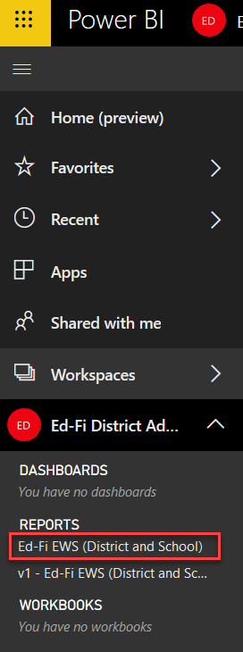
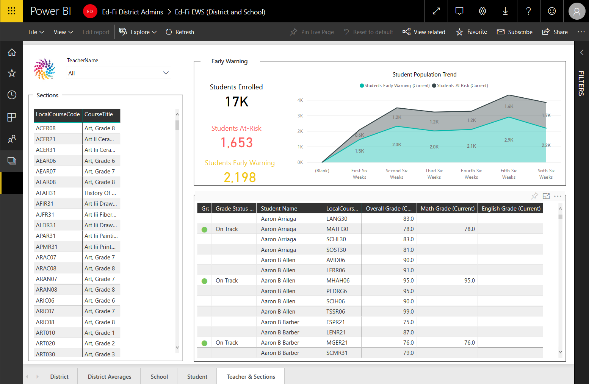
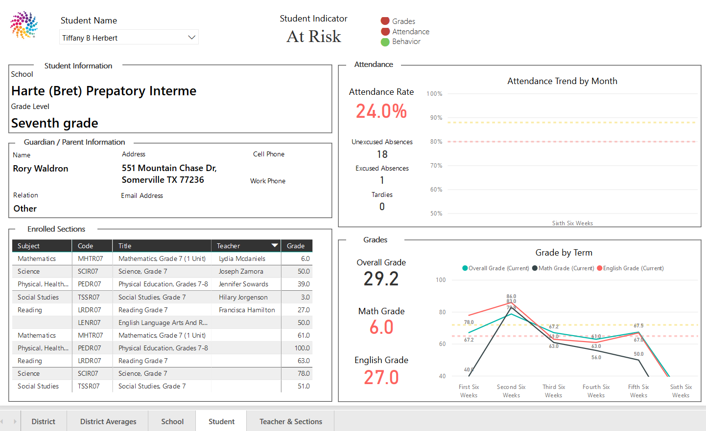
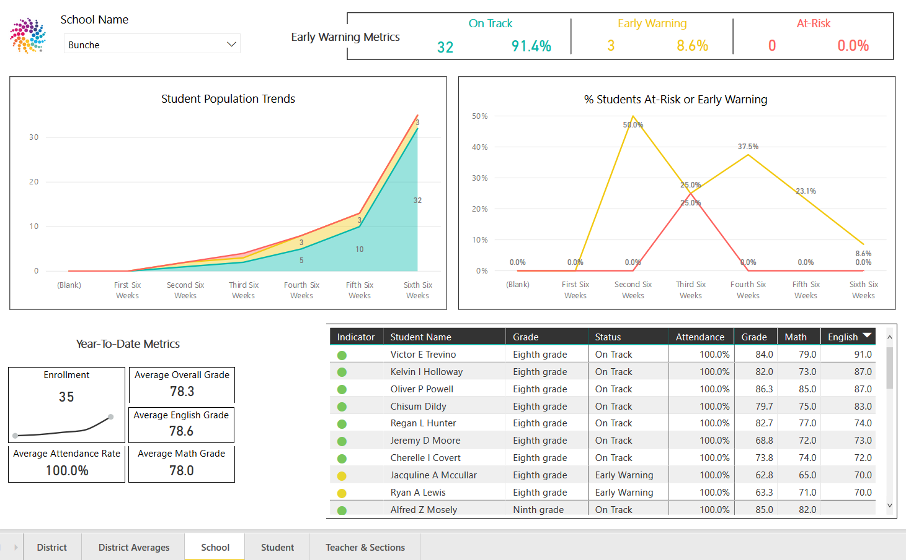
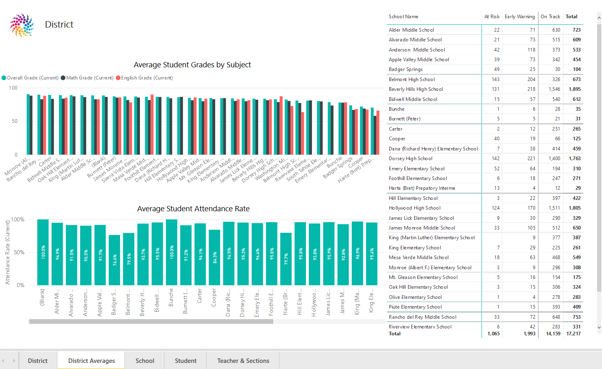
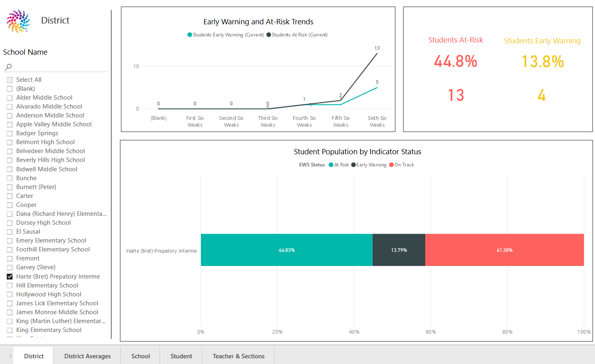
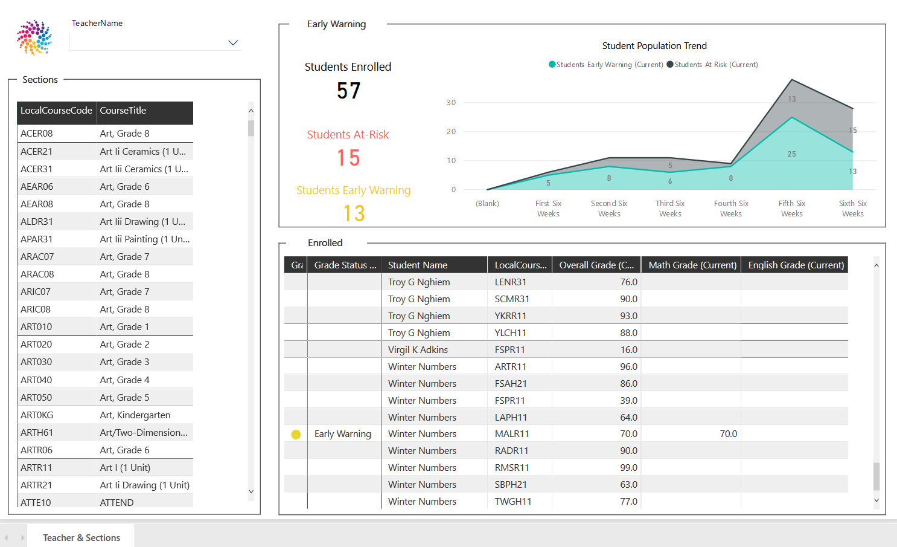

# Solution Overview - Power BI Starter Kit

December 18, 2018

* Solution Overview
* [Deployment](deployment.md)
* [Technical Details](technical-details.md)
* [Early Warning Metrics](early-warning-metrics.md)

## Table of Contents

<!-- vscode-markdown-toc -->
* [Introduction](#Introduction)
* [Sample Screens](#SampleScreens)
	* [Accessing the Reports](#AccessingtheReports)
	* [District Reports](#DistrictReports)
	* [Teacher Reports](#TeacherReports)
* [Prerequisites](#Prerequisites)
* [Components](#Components)
	* [Azure Components](#AzureComponents)
		* [Analysis Services](#AnalysisServices)
		* [Azure Automation](#AzureAutomation)
	* [Office 365 Components](#Office365Components)
		* [Ed-Fi EWS Office 365 Groups](#Ed-FiEWSOffice365Groups)
	* [Power BI Components](#PowerBIComponents)
		* [District and School PBIX](#DistrictandSchoolPBIX)
		* [Teacher PBIX](#TeacherPBIX)
* [Release Notes](#ReleaseNotes)
	* [Version 2, December 2018](#Version2December2018)

<!-- vscode-markdown-toc-config
	numbering=false
	autoSave=true
	/vscode-markdown-toc-config -->
<!-- /vscode-markdown-toc -->

## Introduction

The Sample Education Data Analytics project is a project to illustrate how to
use Microsoft Power BI, a business intelligence (BI) toolset, to create
meaningful visualizations from analysis of data contained in an Ed-Fi ODS. The
result is a set of reports at the district, school, teacher, and student level
for early warning indicators described in the Balfanz  model.

The proof of concept was intended to explore a few key questions on behalf of
the Ed-Fi community, and to generate data that can help community members shape
their plans and investments. Those questions were:

* What are the capabilities of emerging commercial off the shelf (COTS) toolsets
  for business intelligence?
* How can those COTS BI toolkits be applied to the Ed-Fi operational datastore
  and data in Ed-Fi format?
* How can organizations effectively deploy COTS BI toolkits based on Ed-Fi at
  scale, including considering both security and ease-of-use? For this question,
  the POC pursued integration with the K-12 identity platform strategy of
  Microsoft.

> For more information on the Balfanz model, see for example Dr. Balfanz's
> [Johns Hopkins
> profile](https://education.jhu.edu/directory/robert-balfanz-phd/) and [On
> Track for Success: The Use of Early Warning Indicator and Intervention Systems
> to Build a Grad Nation](https://eric.ed.gov/?id=ED526421) (hosted by
> Department of Education).

## Sample Screens

These screenshots demonstrate the deployed visualizations hosted on
PowerBi.com, using the Ed-Fi Glendale data set, containing realistic yet fake
student data.

### Accessing the Reports

When a user first signs-in, the user will need to select a workspace. The
workspace(s) available will depend on how the PowerBI reports are shared by the
administrator. As there are two reports, targeting different audiences, these
screenshots come from two different users.

After selecting a workspace, the user can choose from one or more reports. The
current Starter Kit contains only one report per workspace; the second report in
this screenshot is for illustrative purposes only.

### District Reports

In this first screenshot, please note the tabs at the bottom of the screen,
which allow the user to visit different pages with different kinds of content.
Also note, for comparison later on, that this Teacher page shows 17,000 students
enrolled. The user in this case is a district administrator who has access to
all student data in the district.

The next four pages are only accessible by district users, not by individual
teachers.

### Teacher Reports

The one report available to Teachers is identical to the one available to
District Administrators. However, note the difference in record count -
comparing 17,000 in the prior screenshot to merely 57 enrolled students in this
version. The difference is due to the row-level security in the data layer,
which allows district administrators to see all data and (by default) allows a
teacher to see a student's data only if the student is in that teacher's class.

## Prerequisites

* An Ed-Fi ODS version 2.4 or 2.5, running via the Cloud ODS or on-premise.
* Microsoft Azure Subscription
* Microsoft Office 365 Subscription
* _Optional_: School Data Sync enabled and populated
* Access as an Azure Global Administrator
* Access as and Office 365 Admin
* SQL Server Management Studio (17.x)
* Power BI Desktop
* Power BI Pro License
  * To publish Power BI Desktop files to a group workspace, the user must have a
    Power BI Pro license.
  * More information can be found at https://www.powerbi.com.
* _Optional_: On-premise Data Gateway
  * If using an on-premise ODS, an Azure Data Gateway service application must
    be installed on the network.  This will provide a secure gateway for Azure
    Analysis Services to query data from the ODS.  This must be done before
    deploying the Tabular Model.

## Components

There are three main categories of components that are included with this
project: Azure Components, Office 365 Components, and Power BI Components. In
addition, the Power BI Components depend on installation of the Analytics Middle
Tier into the ODS database.

### Azure Components

The entire infrastructure of this project relies on Microsoft Azure’s PaaS
(platform-as-a-service) offerings. These include:

* Analysis Services
* Automation

#### Analysis Services

Azure Analysis Services (AAS) is Microsoft’s platform-as-a-service offering for
SQL Server Analysis Services. Specifically, this is used to host an in-memory
Tabular Model that is connected to an Ed-Fi ODS database.

#### Azure Automation

Azure Automation is the service framework to control Azure services, entirely
from within Azure. These actions can be performed by either a manual trigger or
a scheduled timer.

The Automation account that is deployed contains two PowerShell Runbooks - one
for the Analysis Services schedule, and one for the Tabular Model processing. In
general, these serve three purposes:

1. Suspend the Analysis Services server.
2. Resume the Analysis Services server.
3. Process the Tabular Model with new data from the ODS.

Additionally, a set of credentials are stored within the Azure Automation
account to authenticate all the required commands.

### Office 365 Components

#### Ed-Fi EWS Office 365 Groups

Two Office 365 (O365) Groups are created to match the two roles that are
established in the Tabular Model:

1. Ed-Fi EWS Read All (edfiewsreadall@domain.com)
2. Ed-Fi EWS Student Auth (edfiewsstudentauth@domain.com

`Ed-Fi EWS Student Auth` is the group that all end users should be added to in
production. The `Ed-Fi EWS Read All` group is primarily for testing purposes.

Users added to the `Ed-Fi EWS Student Auth` group can only see the data in the
Ed-Fi EWS data model and Power BI reports if they are logged in with an O365
account that is associated with an Ed-Fi user Id which is associated with
school(s) and section(s) in the underlying Ed-Fi ODS data.  As such, developers
and testers whose O365 accounts are not associated with an Ed-Fi user Id and/or
reflected in the underlying Ed-Fi ODS data would see no data in the Ed-Fi EWS
data model or Power BI reports.  As such, users who need to see data for
development and testing should be added to the `Ed-Fi EWS Read All` group.

Office 365 Groups are used instead of standard security groups because of their
correlation with a Power BI Workspace. Currently, this is the only way to work
with Power BI Workspaces.

### Power BI Components

Power BI Components are shared in the .PBIX file format. This file can be opened
and modified within Power BI Desktop, or published to the PowerBI.com web
service.

#### District and School PBIX

This .PBIX file contains all report content - District, School, Student, and
Teacher & Sections. This file is intended to be published to district and school
administrators.

#### Teacher PBIX

This .PBIX file contains only Teacher & Sections report. This is intended to be
published for teachers.

## Release Notes

### Version 2, December 2018

* The Tabular Data Model has been greatly simplified through use of the
  Analytics Middle Tier, which should facilitate easier modification in the
  field.
* Minor UI improvements in the visualizations