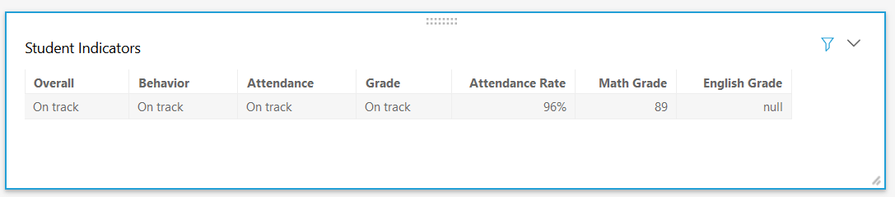
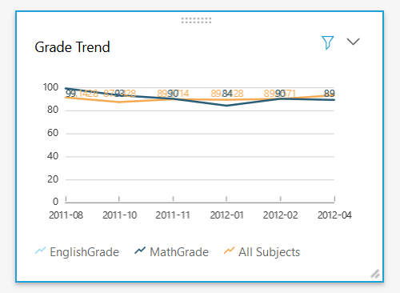
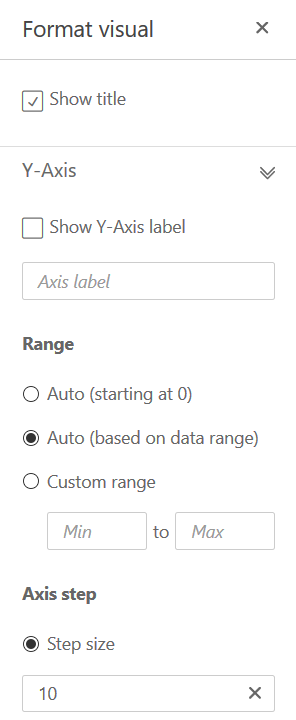
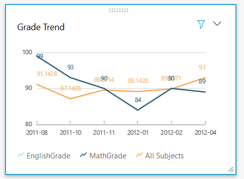
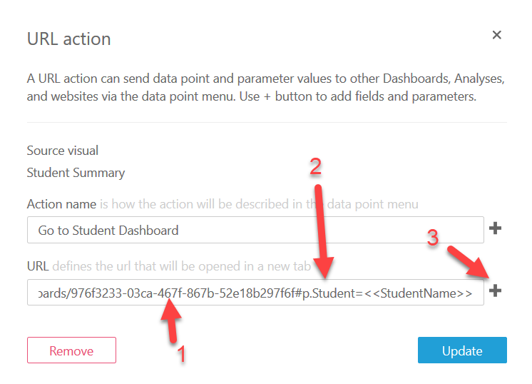

# Enhancing Visuals and Click Through Linking

It is November 28, 2018, and AWS just realized some new features and
enhancements in QuickSight this week ([User management
API](https://docs.aws.amazon.com/quicksight/latest/APIReference/API_Operations.html),
[Embed
dashboards](https://aws.amazon.com/blogs/big-data/embed-interactive-dashboards-in-your-application-with-amazon-quicksight/),
[Machine Learning
preview](https://aws.amazon.com/blogs/big-data/amazon-quicksight-announces-ml-insights-in-preview/)).
This article won't utilize the most exciting new (and previewed) features, but
will instead utilize a few UI enhancements plus incorporate a missed opportunity
from the last go-round: click-through to go from the School Dashboard to the
Student Dashboard.

This article builds off of the [QuickSight Starter Kit](readme.md).

## Changing Column Names

When making a data set available for use by business users as authors, it might
be a good idea to rename a column directly in the data set to something more
user friendly, e.g. "StudentName" to "Student Name". If you don't do that, or
forget to, going back and changing the data set might not be practical. As shown
in the screenshot below, changing the column names is now easy. Appears to be
new functionality in late Nov 2018 - [not even documented
yet](https://docs.aws.amazon.com/quicksight/latest/user/tabular.html)!

1. Click on the down-carat to pull up the visualization's menu.
2. Choose Format Visual.
3. Change the column names under "Group-by column names".

I changed "Student Name". The next two fields are still perfectly readable even
without introducing a space, but "OverallIndicator" is a bit difficult to read
due to the two L's followed by an I.

The above example is from the School Dashboard.

## Reformatting the Indicators Table

Here's the Student Indicators table from the Student Dashboard:

Obviously the column names could be nicer. The column widths and widget height
could benefit from resizing. Column width might have been adjustable in the
past, but the height was already as small as it gets. Thankfully the latest
release allows us to make it even smaller - so now this one-row table doesn't
look quite so odd on the page!

## Reformatting the Grade Trend Graph

Now for the Grade Trend graph on the Student Dashboard:

Do we really need to start the scale at zero? No. But what is a good starting
point for the y-axis? Now we can "auto set" the axis based on the data. On the
first attempt, it showed horizontal lines for 80 and 100. That felt like too
much whitespace, and I wanted a line at 90. Therefore I set the step size to 10.

## Opening the Student Dashboard

Now for the most exciting update to the dashboards: click-through.

The screenshot above also shows you how to get to "URL actions..." in the menu.
[URL
Actions](https://docs.aws.amazon.com/quicksight/latest/user/custom-url-actions.html)
are a way to click on a row and open up a website (or create any other kind of
url, such as a `mailto:` link).

Assuming you've already published a Student Dashboard, open that and copy the
URL. Now click on URL Actions back in the School Dashboard's Student Table. As
shown in the following screenshot:

1. Paste in the Student Dashboard URL.
2. Add `#p.Student=` to the end.
3. Click the `+` icon and select StudentName from the ensuing dropdown.

In step 2, you need to use the precise parameter name in the Student Dashboard.
Don't use the name of the _control_ - use the name of the _parameter_.
(Reference: [Using Parameters in a
URL](https://docs.aws.amazon.com/quicksight/latest/user/parameters-in-a-url.html))

Now your users can click on a row and go directly to the student dashboard. Note
that the URL now has the student's name in it, and the `Student Name` control
was populated automatically.

