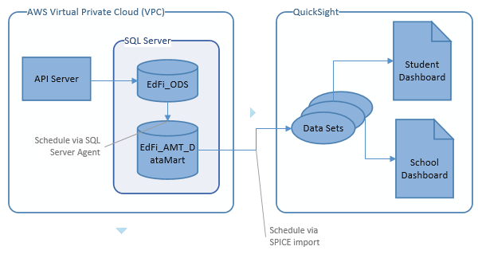
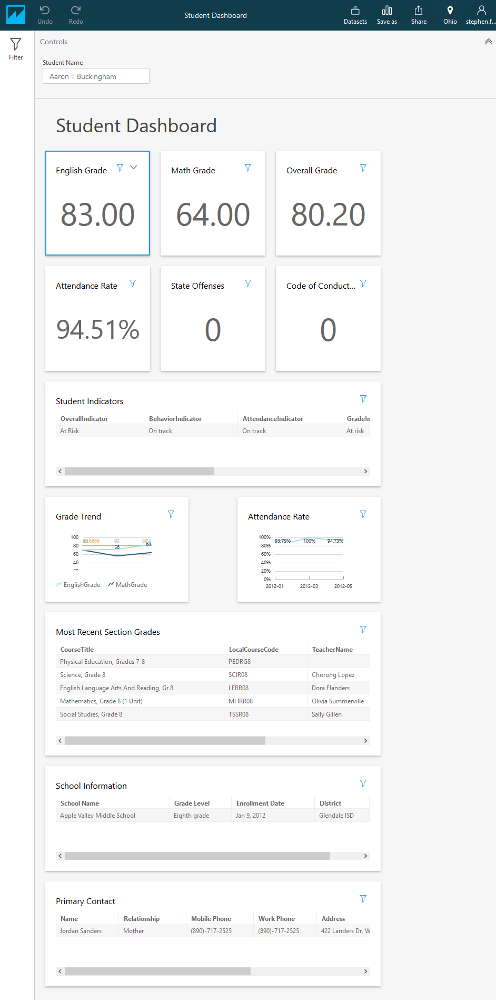
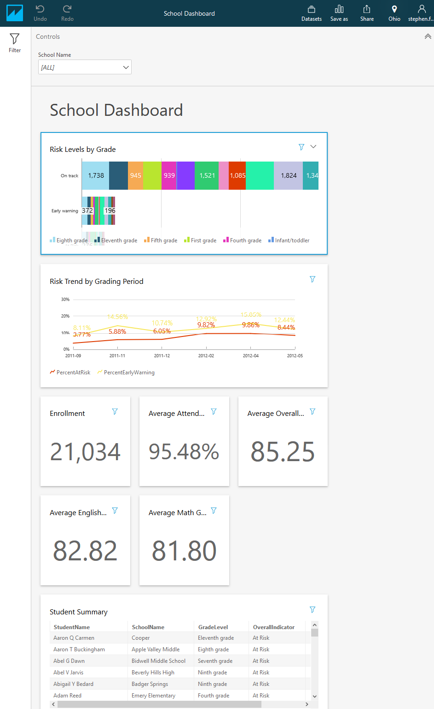

# Ed-Fi QuickSight Starter Kit

## Additional Tips

* [Enhancing the Student Table in the School
  Dashboard](enhance-the-student-table.md) shows how to improve the display and
  add click through from School Dashboard to Student Dashboard (Nov 28, 2018)

## Introduction

The Ed-Fi Alliance has built out two dashboards in AWS QuickSight, using the
[Analytics Middle
Tier](https://github.com/Ed-Fi-Alliance-OSS/Ed-Fi-Analytics-Middle-Tier). These
dashboards demonstrate use of the new middle tier for analyzing early warning
signs for potential student dropout, for both the individual student and
aggregated for a school.

QuickSight does not offer any mechanism for creating a share-able asset out of a
dashboard. In other words, there is no code to share with the community. This
lightweight documentation is being provided to assist others in recreating these
dashboards.

(!) Forewarning: this document does not provide step-by-step instructions. The
reader will likely want to experiment with QuickSight independently - creating a
data source from a SQL Server instance, creating a data set from that, and then
analyzing that data set - before attempting to recreate the Ed-Fi dashboards.
[Getting Started with Data Analysis in Amazon
QuickSight](https://docs.aws.amazon.com/quicksight/latest/user/getting-started.html)

## Demonstration

To view the dashboards, contact Ed-Fi staff to request access to the
demonstration environment. Ed-Fi community members can find the demonstration
URLs and credentials in the [Ed-Fi
Exchange](https://techdocs.ed-fi.org/display/EXCHANGE/AWS+QuickSight+Starter+Kit).

## Architecture



## SQL Server Preparation

### Retrieve Analytics Middle Tier Source Code

1. Clone
   [Ed-Fi-X-Analytics-Middle-Tier](https://github.com/Ed-Fi-Alliance-OSS/Ed-FiAnalytics-Middle-Tier).
1. Checkout from the `QuickSight-1` tag: `git checkout QuickSight-1`.
1. Build the solution in Visual Studio or at the command line.

### Install Analytics Middle Tier in the ODS

[Install the Analytics Middle
Tier](https://github.com/Ed-Fi-Alliance-OSS/Ed-Fi-Analytics-Middle-Tier/blob/main/docs/installation.md)
in your ODS database, optionally installing on a read-only copy in order to
reduce the performance impact on the production database. The Data Mart
described below makes the read-only database less important, as it basically
serves that purpose. However, populating the Data Mart database will still cause
load on the production ODS and you may want to monitor the impact.

The syntax in this branch has changed a little. The project is now split into
multiple components: base (always installed), indexes, and EWS views (new views
for QuickSight). In the ODS database you do not need the EWS views. If you want
to install the indexes, then execute with flag: `--options Indexes`:

```powershell
.\EdFi.AnalyticsMiddleTier.Console.exe `
     --connectionString "Server=reallylongservername.rds.amazonaws.com;Database=EdFi_ODS;Trusted_connection=true" `
     --options Indexes
```

### Create the Data Mart Database

The Analytics Middle Tier was designed to allow BI tools to do the "heavy
lifting" on calculations. However, while QuickSight does have good tools for
performing aggregate calculations, we encountered a significant limitation: no
ability to perform a calculation on top of another calculation. For example, we
could not find any way to build, entirely within QuickSight, the calculation of
the "on track / early warning / at risk" indicator for a student.

To resolve this, and contrary to the published best-practice, most of the
calculations are performed using new views in the Analytics Middle Tier,
installed in a new database that materializes the basic views into concrete
tables.

1. Create a new database, for example `EdFi_AMT_DataMart` (you can choose any
   name).
1. Open the files `Samples/AMT-DataMart.sql` in the Analytics Middle Tier
   repository.
1. Set to use SQL Command Mode and adjust the database names on lines 11 and 12
   as needed (especially line 12 - e.g. `EdFi_ODS` rather than `EdFi_Glendale`).
1. This script is built with the assumption that the ODS (whether production or
   read-only copy) and the new Data Mart database are on the same server. One
   could tweak the script to use linked servers if needed.
1. Run the script to:
    1. Load all core/base Analytics Middle Tier view data into staging tables in
       the Data Mart, e.g. from `DateDimension`  to `stg_DateDimension`.
    1. Create indexes on the staging tables.
    1. Drop the live tables _if they exist_. <-- this allows you to run this
       script periodically to refresh the data.
    1. Rename the staging tables so that they are now the live tables.
    1. Copy the `AnalyticsMiddleTierSchemaVersion` table from the source to
       destination database, keeping only the rows representing the base view
       installation.
1. Schedule this script to run periodically using SQL Server Agent.
1. Re-run the Analytics Middle Tier installer, now pointing to the Data Mart
   database instead of the ODS database and using the flag `--option EWS`.
1. Create a database user that you'll use in QuickSight to connect to the
   DataMart database. Since there are no tables other than the Analytics Middle
   Tier tables, you can safely grant that use `db_datareader` access.

Step 5.5 fakes out the installer, so that it doesn't try to install the base
views - which you just created as tables! Step 7, installs the new EWS-specific
views.

## QuickSight

### Data Sets

For our dashboards, we created several different data sets instead of creating a
single big data set for each dashboard. This helps reduce the amount of SPICE
data used and seems to be efficient. The section headings below are the actual
names that we gave to the data sets.

#### Grade Trend

##### Grade Trend Tables

* `StudentDimension`
* `StudentSectionGradeFact`: join on both `StudentKey` and `SchoolKey`
  * `GradingPeriodDimension`: join on `GradingPeriodKey`
    * `DateDimension`: join on `GradingPeriodBeginDateKey` = `DateKey`
  * `StudentSectionDimension`: join on `StudentSectionKey`

##### Grade Trend Columns

* `EnglishGrade` =

```sql
ifelse({Subject}='English Language Arts' or {Subject}='Reading' or {Subject}='Writing',{NumericGradeEarned},null)
```

* `MathGrade` = `ifelse({Subject}='Mathematics',{NumericGradeEarned},null)
* `StudentName` = `trim(concat(trim(concat({StudentFirstName},'
  ',{StudentMiddleName})),' ',{StudentLastName}))`
* `YearAndMonth` =

```sql
concat(
    toString({CalendarYear}),
    '-',
    right(
        concat(
            '0',
            toString({Month})
        ),
        2
    )
)
```

* `SectionKey` = `{SectionKey[StudentSectionDimension]}`
* `SchoolKey` = `{SchoolKey[StudentSectionDimension]}`
* `StudentKey` = `{StudentKey[StudentDimension]}`
* `NumericGradeEarned` --> rename as `All Subjects`

#### Attendance Trend

##### Attendance Trend Tables

* `StudentEarlyWarningFact`
* `StudentDimension`: `StudentKey`
  * `StudentSectionDimension`: join on both `StudentKey` and `SchoolKey`
* `DateDimension`: join on `DateKey`

##### Attendance Trend Columns

* `IsEnrolledD` = `intToDecimal({IsEnrolled})`
  * the extra `D` is not a typo - needed something to help signal the conversion
    to decimal data type.
* `IsAbsent` =
  * Note "anyclass" not included here, but might be appropriate for some
    schools.

  ```sql
  intToDecimal(
      ifelse(
          {IsAbsentFromHomeroomExcused} = 1 OR
          {IsAbsentFromHomeroomUnexcused} = 1 OR
          {IsAbsentFromSchoolExcused} = 1 OR
          {IsAbsentFromSchoolUnexcused} = 1,
          1,
          0
      )
  )
  ```

* `StudentName` = `trim(concat(trim(concat({StudentFirstName},'
  ',{StudentMiddleName})),' ',{StudentLastName}))`
* `YearAndMonth` =

  ```sql
  concat(
      toString({CalendarYear}),
      '-',
      right(
          concat(
              '0',
              toString({Month})
          ),
          2
      )
  )
  ```

* `SchoolKey` = `{SchoolKey[StudentEarlyWarningFact]}`
* `StudentKey` = `{StudentKey[StudentEarlyWarningFact]}`

##### Attendance Trend Filter

* `IsInstructionalDay` = 1

#### Student Description

##### Student Description Tables

* `StudentDimension`
* `SchoolDimension`: join on `SchoolKey`

##### Student Description Columns

Renamed because the column names are being displayed in a table in the dashboard

Click dropdown on the column to rename as implied by --> symbol below.

* `School` --> `SchoolName`
* `StudenKey` = `{StudentKey[StudentDimension]}`
* `Student Name` = `trim(concat(trim(concat({StudentFirstName},' ',{StudentMiddleName})),' ',{StudentLastName}))`
* `Address` --> `ContactAddress`
* `Relationship` --> `ContactRelationship`
* `Enrollment Date` --> `EnrollmentDate`
* `Work Phone` --> `ContactWorkPhoneNumber`
* `Mobile Phone` --> `ContactMobilePhoneNumber`
* `Grade Level` --> `GradeLevel`
* `Name` --> `ContactName`
* `Email Address` --> `ContactEmailAddress`
* `SchoolKey` = `{SchoolKey[StudentDimension]}`
* `SchoolAddress` --> `School Address`
* `SchoolCity` --> `School City`
* `SchoolCounty` --> `School County`
* `SchoolState` --> `School State`
* `LocalEducationAgencyName` --> `District`
* `StateEducationAgencyName` --> `State`
* `EducationServiceCenterName` --> `Service Center`

#### Student Behavior

##### Student Behavior Tables

* `StudentEarlyWarningFact`
* `StudentDimension`

##### Student Behavior Columns

* `StudentName` = `trim(concat(trim(concat({StudentFirstName},'
  ',{StudentMiddleName})),' ',{StudentLastName}))`
* `SchoolKey` = `{SchoolKey[StudentDimension]}`
* `StudenKey` = `{StudentKey[StudentDimension]}`
* `CountByDayOfStateOffenses`
* `CountByDayOfConductOffenses`

#### Section Grades Most Recent

##### Section Grades Most Recent Tables

* `StudentSectionGradeFact`
* `GradingPeriodDimension`: `GradingPeriodKey`
  * `MostRecentGradingPeriod`: join on both `GradingPeriodBeginDateKey` and
    `SchoolKey`
* `StudentDimension`: join on both `StudentKey` and `SchoolKey`
* `StudentSectionDimension`: join on `StudentSectionKey`

##### Section Grades Most Recent Columns

* `EnglishGrade` = `ifelse({Subject}="English Language Arts" or
  {Subject}="Reading" or {Subject} = "Writing", {NumericGradeEarned}, null)`
* `MathGrade` = `ifelse({Subject}="Mathematics", {NumericGradeEarned}, null)`
* `StudentName` = `trim(concat(trim(concat({StudentFirstName},'
  ',{StudentMiddleName})),' ',{StudentLastName}))`
* `StudentKey` = `{StudentKey[StudentDimension]}`
* `SchoolKey` = `{SchoolKey[StudentSectionDimension]}`
* `SectionKey` = `{SectionKey[StudentSectionDimension]}`
* `NumericGradeEarned`
* `LocalCourseCode`
* `Subject`
* `CourseTitle`
* `TeacherName`

#### Student Indicators

##### Student Indicators Tables

* `StudentDimension`
* `Ews_StudentIndicators`: join on both `StudentKey` and `SchoolKey`
* `StudentSectionDimension`: `StudentKey` and `SchoolKey`

##### Student Indicators Columns

* `StudentName` = `trim(concat(trim(concat({StudentFirstName},'
  ',{StudentMiddleName})),' ',{StudentLastName}))`
* `SchoolKey` = `{SchoolKey[StudentDimension]}`
* `MathGrade`
* `EnglishGrade`
* `OverallGrade`
* `AttendanceRate`
* `GradeIndicator`
* `AttendanceIndicator`
* `BehaviorIndicator`
* `SectionKey`

#### School Indicators

##### School Indicators Tables

* `School`
* `StudentDimension` join on `SchoolKey`
  * `Ews_StudentIndicators` join on both  `SchoolKey` and `StudentKey`

##### School Indicators Columns

* `SchoolKey` = `{SchoolKey[SchoolDimension]}`
* `StudentName` = `trim(concat(trim(concat({StudentFirstName},'
  ',{StudentMiddleName})),' ',{StudentLastName}))`
* `SchoolName`
* `SchoolAddress`
* `SchoolCity`
* `SchoolCountry`
* `SchoolState`
* `LocalEducationAgencyName`
* `EducationServiceCenterName`
* `StateEducationAgencyName`
* `GradeLevel`
* `MathGrade`
* `EnglishGrade`
* `OverallGrade`
* `AttendanceRate`
* `GradeIndicator`
* `AttendanceIndicator`
* `BehaviorIndicator`
* `OverallIndicator`

#### School Risk Trend

##### School Risk Trend Tables

* `EWS_SchoolRiskTrend`
* `SchoolDimension` joined on `SchoolKey`

##### School Risk Trend Columns

* `SchoolKey` = `{SchoolKey[SchoolDimension]}`
* `YearMonth`
* `PercentEarlyWarning`
* `PercentAtRisk`
* `Enrolled`
* `EarlyWarning`
* `AtRisk`
* `SchoolName`
* `SchoolType`
* `LocalEducationAgencyName`
* `StateEducationAgencyName`
* `EducationServiceCenterName`

#### Student Indicators Trend

##### Student Indicators Trend Tables

* `StudentIndicatorsByGradingPeriod`
* `StudentSectionDimension`: join on both `StudentKey` and `SchoolKey`

##### Student Indicators Trend Columns

* `SchoolKey = {SchoolKey[StudentSectionDimension]}`
* `SectionKey`
* `CalendarYear`
* `Month`
* `MatGrade`
* `EnglishGrade`
* `OverallGrade`
* `AttendanceRate`
* `GradeIndicator`
* `AttendanceIndicator`
* `BehaviorIndicator`
* `OverallIndicator`

### Row Level Security

Add one more data set, called `UserSchoolAuthorization`, pulling from
`Ews_UserSchoolAuthorization`. Re-open each data set _except_
`UserSchoolAuthorization`. Click the `Permissions` button and use
`UserSchoolAuthorization` to limit access by school.

(!) Note that teachers will have access to all students in the school, not just
the students in their sections. We had trouble getting student-based security
working because the number of students per user seemed to be too large for
QuickSight to handle. 

### Analyses (Dashboards)

#### Parameters / Filters

For both dashboards, create a parameter: `StudentName` for the Student Dashboard
and `SchoolName` for the School Dashboard. Each time you connect a data set, be
sure to setup  a filter properly, connected to the parameter. For the Student
Dashboard, you want a filter on `StudentName`. For the School Dashboard, create
a filter on SchoolName. Finally, create a Control connected to the filter.

#### Student Dashboard

Note that we didn't create a dropdown control for the Student Name. This is
because the dropdown can support maximum 10,000 students. A district
administrator in a district with > 9,999 students would have a broken dropdown
and thus an unusable dashboard. One could work around this by creating a second
copy of the Student Dashboard, adding a dropdown to the Student Name. This
second copy would be for school-level users. The original copy would be for
district-wide users.

(!) In a large district, middle name / initial might not be sufficient for
differentiating two students. It might be necessary to inject the the unique
`StudentKey` into the name.



##### Student KPIs

* English Grade from `Section Grades Most Recent` : `EnglishGrade` (average)
  (format to two decimal)
* Math Grade from `Section Grades Most Recent` : `MathGrade` (average) (format
  to two decimal)
* Overall Grade from `Section Grades Most Recent` : `NumericGradeEarned`
  (average) (format to two decimal)
* Attendance Rate from `School Indicators` : `AttendanceRate` (format as %)
* State Offenses from `Current Attendance and Behavior` :
  `CountByDayOfStateOffenses` (sum)
* Code of Conduct Violations from `Current Attendance and Behavior` :
  `CountByDayOfConductOffenses` (sum)

##### Student Tables

* Student Indicators
  * Data set: `Student Indicators`
  * `Overall Indicator` - convert to measure
  * `Attendance Indicator`- convert to measure
  * `Behavior Indicator` - convert to measure
  * `Attendance Rate`
  * `Math Grade`
  * `English Grade`
* Enrolled Sections
  * Data set: `Section Grades Most Recent`
  * `Subject`
  * `LocalCourseCode`
  * `CourseTitle`
  * `TeacherName`
  * `NumericGradeEarned` (average)
* School Information
  * Data set: `Student Description`
  * `School`
  * `Grade Level`
  * `Enrollment Date`
* Primary Contact
  * Data set: `Student Description`
  * `Name`
  * `Relationship`
  * `Mobile Phone`
  * `Work Phone`
  * `Email Address`
  * `Address`

#### Student Graphs

* Grade Trend
  * Data set: `Grade Trend`
  * X: `YearAndMonth` (sort)
  * Value:
    * `EnglishGrade` (average)
    * `MathGrade` (average)
    * `OverallGrade` (average)
* Attendance Trend
  * Data set: `Attendance Trend`
  * X: `YearMonth`
  * Value: `AttendanceRate = (sum({calculated_column_91}) -
    sum({calculated_column_88})) / sum({calculated_column_91})`

#### School Dashboard

Note that this one has a control with a dropdown. The dropdown is selecting from
the `SchoolDimension` data set.



##### School KPIs

* Enrollment from `School Indicators` : `GradeLevel` (count)
* Average Attendance Rate from `School Indicators` : `AttendanceRate` (average)
  (display as %)
* Average Overall Grade from `School Indicators` : `OverallGrade` (average)
  (format for two digits)
* Average English Grade from `School Indicators` : `English Grade` (average)
  (format for two digits)
* Average Math Grade from `School Indicators` : `Math Grade` (average) (format
  for two digits)

##### School Tables

* Students
  * Data set: `School Indicators`
  * Group By
    * `StudentName`
    * `SchoolName`
    * `GradeLevel`
    * `OverallIndicator`
  * Value
    * `OverallGrade` (max)

##### School Graphs

* Risk by Grade
  * Vertical bars
  * Data set: `School Indicators`
  * Y Axis: `OverallIndicator`
  * Value: `OverallIndicator`
  * Group/Color: `GradeLevel`
* Risk Trend By Grading Period
  * Line graph
  * Data set: `School Risk Trend`
  * X Axis: `YearMonth` (sort)
  * Value:
    * `PercentAtRisk` - click on the line and change color to red
    * `PercentEarlyWarning` - click on the line and change color to yellow